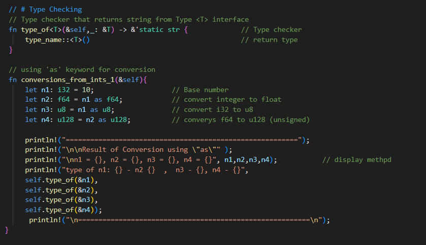
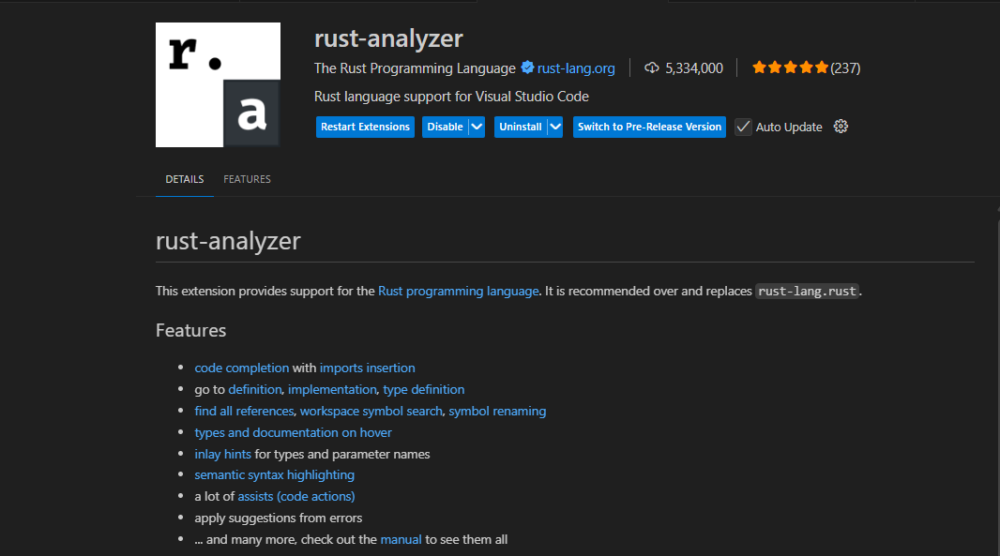

## CMSC 308 Programming Languages 
#### Rust Code Demo and Examples
--------------------------------------------------

<p align="center">
  
  
  
</p>

***
<br>

<p align ="center">



<br>
<i>Logo and sample Source code</i>
  
</p>


### About Rust

<p align = "justify">
  <em>Rust</em> is a general purpose programming languages and is notables fo its emphasis to performance, type safety, concurrency and memory safety. It supports multiple programming paradigms and was influenced by ideas from functions programming, including immutability, higher-order functions, varied order data types and pattern matching. See <a href="https://en.wikipedia.org/wiki/Rust_(programming_language)">Wikipedia </a> and <a href = "https://doc.rust-lang.org/stable/"> Rust Documentation </a>
  
</p>

## About this source code
<p align = "justify">
  <b>This source code is intended for demo purposes only</b>. Every source code is written purely with rust and runs via cargo package manager. "Cargo" is Rust's build system and package manager for standard libraries. While this source code is intended to be executed using cargo in a native IDE (e.g. Visual Studio), each separate project file can be execured in an online Compiler.

  <b>Recommended Online Compiler</b>
  Online GDB: https://www.onlinegdb.com/online_rust_compiler
</p>

### Important Note
> This reporsitory is a collection of multiple projects, it is not a standalone

<br>

*** 

### How to run this source code?
<p align ="justify">
  There are two general way to run these source codes: Either by using an <a href = "https://www.onlinegdb.com/online_rust_compiler">online compiler</a> or by a local compiler (using Cargo) in visual studio code. Each source code within the file collection pool of a rust project is always contained in an <em>"src"</em> folder 
</p>
<br><br>
 
<br>
---

#### Running a source code in an online compiler
<p align ="justify">
  Running a rust source code in an online compiler is a straight forward process. <br> <br>
  1. Navigate through the "src" folder of a rust project and open the main rust file. <br>
  2. Copy the source code from the source file and create a new project in the online compiler. <br>
  3. Paste the source code in the created project from the online compiler and execute the source code. <br>
</p>
<br>

---


#### Running a source code in a Local Compiler

<p align = "justify">
  Compared on using an online compiler, running rust codes locally in a device requires downloading the following dependencies in order to run these source codes

 1. <a href ="https://rust-lang.org/tools/install/">RUST-INIT-x64</a>
 2. <a href = "https://visualstudio.microsoft.com/downloads/">C++ build tools (via visual studio installer) </a>
 3. <a href ="https://marketplace.visualstudio.com/items?itemName=rust-lang.rust-analyzer"> Rust-Analyzer visual studio code extension </a>

 <br><br>
</p>

#### Installing RUST-INIT-x64
<p align ="justify">
Download the rust-init-x64 version for x64 base machines, or the x32 for 32-bit machines. Press enter to continue for the standard installation, or select <em>Custom</em> to modify the packages and the installation directory
<br><br>

<br>
</p>

#### Installing C++ Build Tools
<p align ="justify">
If you have no Visual Studio and its vs-installer installed, you can download and install vs-studio <a href = "https://visualstudio.microsoft.com/downloads/">here</a>. via vs-installer<br>
Once installed, open your visual studio installer, modify the installation packagaes from the pannel, and download <em>Desktop Development with C++</em>
<br><br>

</p>

#### Installing Rust Anlyzer 
<p align ="justify">
In Visual Stdio Code, navigate to the extension panel and search for <em>Rust-Analyzer</em> and install the extension
<br> <br>

<br>
</p>

---
### Running Source Code
<p align ="justify">
After installing all necessary tools and dependencies, you can now proceed on the execution process of the source code:
But first, clone this project to your local machine via git.
</p>

### Open your terminal and run these commands
<p align ="justify"> Make sure that git. command line  is installed in your devices. Otherwise, you can install it from <a href = "https://git-scm.com/">here</a>
<br><br>

</p>

<p>Select your file directory</p>

> Note: The directory should be encapsulated with "" symbol,  e.g. cd "C:\Brave Downloads\Ran"

```
cd <path from your device>
```
<p></p>

<p>
  then run the clone command from your directory using this command
</p>

```
git clone https://github.com/KalaPhantom/CMSC-308_RUST-CODE_DEMO.git
```

<p>
  After the cloning process, you must navigate to a specific file folder, as this project repository is not a standalone project. You can use the same cd command to do so <br>
  <br> Example:
</p>

```
cd "D:\Brave Downloads\Ran\CMSC-308_RUST-CODE_DEMO\(Terminal) Todo App - For Overview Purposes"
```

<p>
   You can now open the source codes in vs code. You can use this command to open the directory to the vs-code
</p>

```
code .
```

<p><br></p>

### Executing the codes in the vs-code
<p>
  If you installed the code-analyzer extension from the earlier process, you should be able to run the source codes directly from the IDE <br><br>
</p>


<p align = "center">
  
  <br><br>
</p>


---
### Created by:

<p align="center">
   
   
  <br><br>
  Roño, Keeshia Mae S. <br>
  Lerado, Allen N.
</p>


